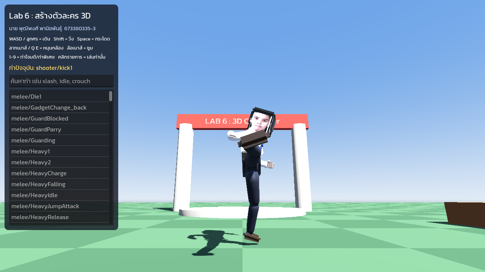

# Lab 6 – สร้างตัวละคร 3D

นาย พุฒิพงศ์ พานิชพันธุ์ 673380335-3 · วิชา Computer Game Development

**ทดลองเล่น:** https://super-super-dev.github.io/lab6_prod/



## ขั้นตอนที่ทำ

1. **Blender 4.5:** สร้างตัวละครชุดนักศึกษา ใช้ภาพใบหน้าตนเองเป็น texture บนหัว (`blender_source/`)
   - `build_character.py` สร้างโมเดล, Armature และ export `.glb`
   - โครงกระดูกตั้งชื่อแบบ Mixamo (`mixamorig_Hips`, `mixamorig_Spine` …) และมี animation T-Pose 1 ท่า
2. **Godot 4.7:** import `assets/character/student_character.glb` แล้วตั้ง Retarget ด้วย
   `Mixamo BoneMap.tres` (โครงกระดูกถูกเปลี่ยนเป็น `GeneralSkeleton`)
3. เพิ่ม Animation Library จาก [Godot4-OpenAnimationLibraries](https://github.com/catprisbrey/Godot4-OpenAnimationLibraries)
   ทั้ง `MeleeLib.res` และ `ShooterLib.res`
4. **Scene Demo** (`scenes/main.tscn`): บังคับตัวละครและเลือกดูท่าต่าง ๆ ได้

## การควบคุม

| ปุ่ม | การทำงาน |
|---|---|
| WASD / ลูกศร | เดิน |
| Shift | วิ่ง |
| Space | กระโดด |
| ลากเมาส์ / Q E | หมุนกล้อง |
| ล้อเมาส์ | ซูม |
| 1-9 | Slash, Heavy, Stab, Punch, Kick, Roll, Potion, Shrug, Die |
| คลิกรายการด้านซ้าย | เล่นท่านั้นจาก Melee/Shooter library |

## สร้างตัวละครใหม่จากสคริปต์

```bash
blender --background --python blender_source/build_character.py
```
